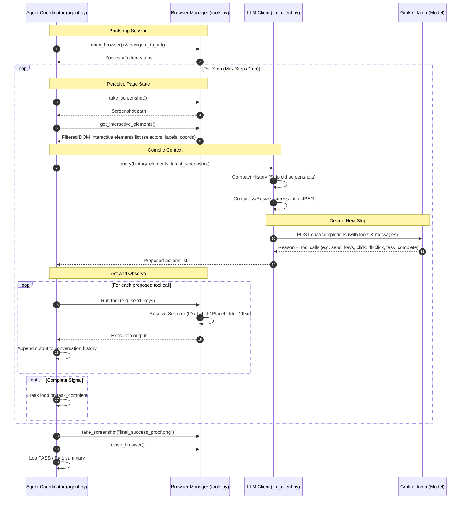

# BrowseIQ

BrowseIQ is a production-quality, runtime LLM-driven browser automation agent built by **Harsha Shetty** (@notharshagit) for a university Gen-AI assignment. 

The agent operates on a **perceive-decide-act** loop: it visually inspects the page, extracts a compact set of interactive elements, sends this state to the LLM (Grok/Llama), decides which browser actions to call next (using native function-calling tools), and executes them via Playwright.

---

## 🛠️ Tech Stack

*   **Browser Automation**: [Playwright (Python Sync API)](https://playwright.dev/python/)
*   **Cognitive Brain**: [xAI Grok](https://x.ai) / [Groq Cloud LPU](https://groq.com) (using OpenAI Python SDK compatibility)
*   **Image Processing**: [Pillow](https://python-pillow.org/) (for compressing screenshots to control token usage)
*   **Config Management**: [python-dotenv](https://github.com/theofidry/django-dotenv-filename)

---

## 📂 Project Structure

```text
BrowseIQ/
├── agent/
│   ├── __init__.py
│   ├── config.py         # Loads configuration and handles key auto-routing
│   ├── tools.py          # Implementations of the 7 Playwright-backed browser tools
│   ├── llm_client.py     # Groq/xAI API client, handles function-calling & history compaction
│   └── agent.py          # Perceive-decide-act loop execution & system prompt
├── tests/                # Unit test files
│   └── test_config.py    # Unit tests for settings loading
├── screenshots/          # Saved timestamped run screenshots (before/after/proofs)
├── logs/                 # Console logs written to logs/agent.log
├── main.py               # Main entrypoint script
├── run_demo.sh           # Bootstrap script to launch agent loop in one click
├── requirements.txt      # Python dependencies
├── .env                  # Environment secrets (ignored from Git)
├── .env.example          # Environment template
└── README.md             # Complete setup, running, and architecture documentation
```

---

## 🔁 The Perceive-Decide-Act Loop

The core architecture follows a standard agentic cycle inspired by systems like *Browser Use* and *OpenAI Agents SDK*.



---

## 🎨 Design Decisions

### 1. Choice of Grok (xAI) and Groq API
*   **xAI Grok** provides state-of-the-art vision reasoning and API compatibility with standard OpenAI SDK endpoints.
*   **Groq Cloud** provides high-speed LPU inference, allowing near-instantaneous agent response loops ideal for interactive demos.
*   **Smart Fallback**: The client (`agent/config.py` and `agent/llm_client.py`) dynamically detects key prefixes (e.g., `gsk_` vs. `xai-`) to select the appropriate endpoint and model.

### 2. Element Detection: Viewport-Filtered DOM vs. Vision
Relying *solely* on coordinate-based vision models is highly fragile: window sizes, responsive layouts, zoom levels, and viewport scrolling cause coordinate mismatches. 
Our **hybrid strategy** provides maximum reliability:
*   **DOM-Text Primary Perception**: Extracts active inputs, textareas, selects, buttons, links (`<a>` tags), and custom elements styled with `cursor: pointer` or inline `onclick` handlers.
*   **Viewport Filtering**: Discards elements outside the viewport scroll boundary (`rect.top` between `-200px` and `window.innerHeight + 800px`) to prevent token bloat and fit within rate limits.
*   **Nesting Deduplication**: Automatically ignores generic child elements (spans, images, or svgs) inside interactive parent tags (buttons or links) to keep prompts concise.
*   **Class Filter Regex**: Discards framework-specific dynamic classes containing special characters (`gap-1.5`, `w-1/2`, `h-[40px]`) and starting with digits, ensuring CSS selectors generated are standards-compliant and never crash the Playwright parser.

### 3. Robust Locator Resolution & Action Fallbacks
When the LLM requests action on a selector, our code provides self-healing paths:
1.  **Fast-Path selector query**: If the selector contains CSS-like tokens (e.g. `.class`, `#id`, spaces, arrows, pseudo-selectors like `:has-text`), it bypasses other locator checks to resolve **instantly**, saving 2-3 seconds of query retries.
2.  **Flexible fallback queries**: Falls back to accessible semantic labels (`page.get_by_label()`), placeholders (`page.get_by_placeholder()`), or roles.
3.  **Forced Click Retry**: If a click is blocked by an overlay modal/sheet, it catches the pointer-interception error and retries with `force=True`. If that fails, it falls back to a raw coordinates hardware mouse click to bypass all actionability blocks.
4.  **Keyboard Emulation typing**: If standard `.fill()` fails (e.g. read-only fields or framework-level blocks), it focuses the element, simulates `Ctrl+A` and `Backspace` to clear it, and types character-by-character via hardware keyboard emulation (`page.keyboard.type`).
5.  **Browser Auto-Recovery**: Checks `is_session_healthy()` dynamically using `page.is_closed()` and `browser.is_connected()`. If the browser window is closed or crashed, it automatically spawns a new Chromium process, restarts the session, and re-navigates back to the current website.

---

## 🚀 Setup and Installation

### 1. Prerequisites
Ensure you have Python 3.10+ installed on your system.

### 2. Clone and Install Dependencies
Navigate to the directory and install dependencies:
```bash
pip install -r requirements.txt
```

### 3. Install Playwright Browsers
Download the Chromium browser binaries required by Playwright:
```bash
python3 -m playwright install chromium
```

---

## 🔑 Configuration and API Keys

The agent supports both xAI Grok and Groq Cloud endpoints natively based on the API key prefix provided in your `.env` file.

### Step 1: Obtain an API Key
*   **Option A: Groq Cloud (Recommended for Speed / Llama 3.3)**
    1. Sign up at the [Groq Console](https://console.groq.com/).
    2. Generate a new API Key (keys start with `gsk_`).
*   **Option B: xAI Console (For Grok-native models)**
    1. Sign up at the [xAI Console](https://console.x.ai/).
    2. Generate an API Key (keys start with `xai-`).

### Step 2: Configure Environment
Create a `.env` file in the root folder (or copy `.env.example`):
```bash
cp .env.example .env
```

Open `.env` and fill out the fields:
```ini
# For Groq (Default setup using your gsk_ key)
XAI_API_KEY=gsk_your_groq_key_here
XAI_API_BASE=https://api.groq.com/openai/v1
XAI_MODEL=llama-3.3-70b-versatile

# For xAI Grok (If using Grok-native key)
# XAI_API_KEY=xai-your-grok-key-here
# XAI_API_BASE=https://api.x.ai/v1
# XAI_MODEL=grok-2-vision-1212

# Automation target URL
TARGET_URL=https://www.google.com

# Headless mode: Set to False to watch the browser work in real-time!
HEADLESS=False

# Safety boundary to prevent runaway loops/costs
MAX_STEPS=10
```

---

## 💻 How to Run

Execute the main controller:
```bash
python3 main.py
```

### 🎛️ Command Line Parameter Options
You can configure the agent dynamically at startup using CLI options:
```bash
# Set a custom target URL, matrix theme, and run in visible headful mode
python3 main.py --url google.com --theme matrix --headful

# Set retro console theme and run in headless background mode with a max step cap of 5
./run_demo.sh --theme retro --headless --max-steps 5
```

| Flag | Shortcut | Default | Description |
|---|---|---|---|
| `--url` | `-u` | From `.env` | Initial target URL to open. |
| `--headless` | | From `.env` | Run browser in hidden headless mode. |
| `--headful` | | From `.env` | Run browser in visible headful window mode. |
| `--theme` | `-t` | `cyberpunk` | CLI console color theme: `cyberpunk`, `retro` (amber), or `matrix` (green). |
| `--max-steps`| `-s` | From `.env` | Maximum autonomous steps before task is terminated. |

### 🤖 Two-Tiered Conversational Console Loop
The program runs in a two-tiered interactive loop:
1. **Website Prompt:** Enter a URL. The browser opens and loads that website.
2. **Task Prompt:** Enter consecutive task instructions (e.g. *Type "John Doe"*, then *Click Submit*). The agent executes them sequentially **on the same active browser context**, preserving the page's scroll positions, filled text, cookies, and login states.

*   **How to switch websites:** Type `exit` at the Task Prompt to close the current browser context and return to the Website Prompt.
*   **How to quit the program:** Type `stop` at either the Website Prompt or the Task Prompt to close the browser and exit the program.
*   **Non-interactive execution (CI/One-off runs):** You can bypass prompts and run a single default task then exit immediately using input redirection:
    `echo -e "google.com\nType 'weather today' and press Enter\nexit\nstop" | python3 main.py`

### Headless vs. Visible (Headed) Mode
To watch the LLM click and type in the browser in real-time:
1. Open your `.env` file.
2. Change `HEADLESS=True` to `HEADLESS=False`.
3. Re-run `python3 main.py`.

---

## 💰 Token and Cost Optimizations

1.  **Image Compression**: Screenshots are compressed to JPEG and scaled down to a maximum dimension of 800px with 80% quality (via Pillow) before encoding, saving up to 85% of standard visual tokens.
2.  **History Compactor**: To prevent sending multiple screenshots repeatedly (which balloons the token size quadratically), the client runs a history compactor. It strips the image payloads from all past turns, preserving only the latest screenshot and the text logs of past operations.
3.  **Nesting & Empty Element Pruning**: Our JS DOM extractor filters out elements without any label, alt text, title, or value text unless they are form inputs, reducing token size significantly.
4.  **Strict 1-Image Constraint**: Keeps track of screenshot executions and suppresses coordinator final screenshots if the task already triggered a screenshot tool call, ensuring exactly one image is saved per task.

---

## 📸 Screenshots and Verification

During the run, the agent automatically captures and saves screenshots in the `screenshots/` directory. To avoid folder clutter, it guarantees **exactly one screenshot is captured per task**:
1. **Explicit Request**: If your task description explicitly asks for a screenshot (e.g. *"take a screenshot of the toast notification"*), it saves that image and skips the automatic coordinator screenshot.
2. **Fallback Proof**: If no screenshot is requested in the task description, the coordinator automatically takes exactly one success/failure screenshot at the end of execution (e.g., `task_1_success.png` or `task_1_failure.png`).
3. **Debug/Error States**: Captured automatically if a fatal code exception occurs.

---

## ❓ Troubleshooting and FAQ

### 1. API Rate Limits (Groq 429 Errors)
*   **Symptom:** Terminal shows `WARNING: API Rate Limit hit... Backing off for 10 seconds`.
*   **Solution:** Groq's free tier has strict rate limits. The agent automatically detects these limit limits, halts execution for 10 seconds, and retries the operation. No manual action is required.

### 2. Browser process has been closed
*   **Symptom:** The Chromium window is closed by accident, and standard actions report errors.
*   **Solution:** The agent is self-healing. Before navigating or performing any task, it checks session health. If it detects the browser was closed, it automatically launches a fresh window and re-navigates back to your target URL.

### 3. Click pointer-interception blocks
*   **Symptom:** A cookie notice, sheet overlay, or modal blocks an element.
*   **Solution:** Playwright tools will catch this interception, retry using `force=True`, and if that fails, trigger a raw mouse click at the element center coordinates to bypass standard visibility guards.
