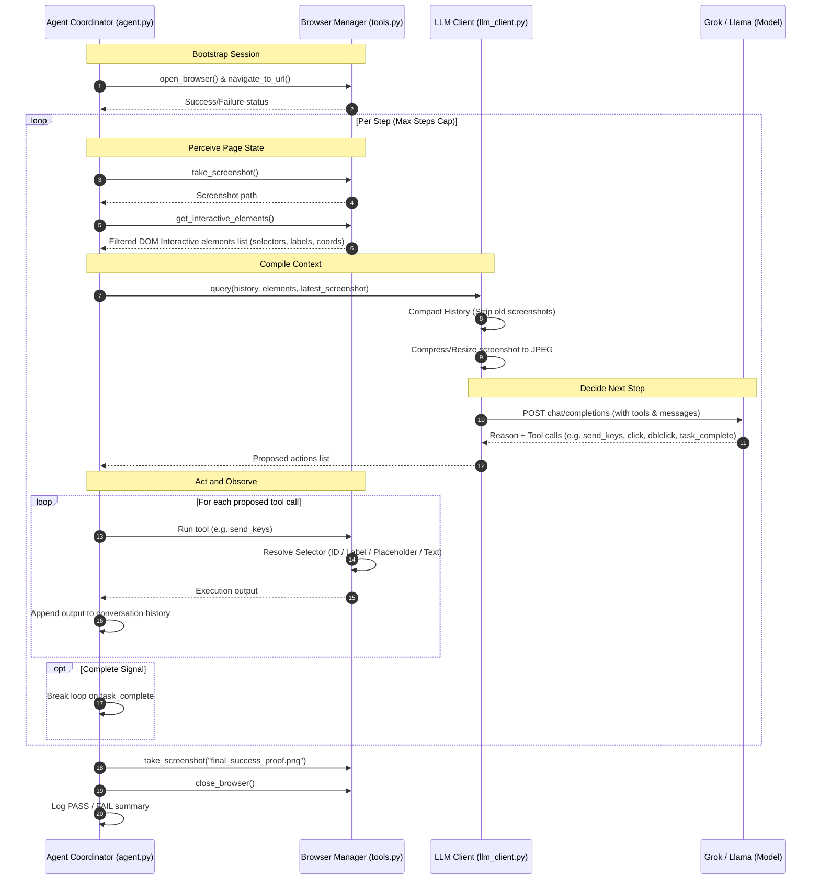

# BrowseIQ

BrowseIQ is a runtime, LLM-driven browser automation agent that runs in a conversational loop. I built this project for a university Gen-AI assignment to show how LLMs can act as cognitive controllers to navigate the web, fill forms, and run consecutive tasks autonomously using Playwright.

---

## 🚀 Core Capabilities & Features

Here is a breakdown of what BrowseIQ can do:

* **Persistent Browser Sessions**: The browser stays open across consecutive tasks, maintaining cookies, scrolling states, login sessions, and form data. You can perform multi-step operations on the same page.
* **Semantic Selector Parsing**: Discards layout elements (like nested svgs or wrapper spans) and extracts active buttons, links, dropdowns, and text inputs to build a compact representation of the page.
* **Robust Actuators & Actions**:
  * **Self-Healing Clicks**: Executes standard clicks, falls back to forced clicks if blocked by overlay banners/modals, and retries via raw mouse coordinates if standard actions fail.
  * **Keystroke Emulation**: Emulates keyboard typing (focusing, clearing via `Ctrl+A` + `Backspace`, and entering text key-by-key) if standard input filling is blocked.
  * **Scroll & Wheel Control**: Executes page scrolls and emulates scroll-wheel ticks to trigger lazy loaders and infinite scrolling.
* **Auto-Recovery & Self-Healing**: Checks the connection health on every step. If the browser window crashes or is closed, it automatically launches a new Chromium process, restarts the session, and re-navigates.
* **Organized Telemetry & Screenshots**: 
  * Captures exactly one proof screenshot per task (success or failure) to avoid folder clutter.
  * Groups screenshots automatically in host-specific subdirectories based on target domains (e.g. `screenshots/google.com/`).
* **Provider Auto-Routing**: Automatically routes queries to Groq Cloud LPUs or xAI Grok by parsing API key prefixes (`gsk_` vs. `xai-`).
* **Dynamic Styling Console Themes**: Choose between visual aesthetics like cyberpunk (neon cyan/pink), matrix (terminal green), or retro (amber orange) using CLI flags.

---

## 🛠️ The Tech Stack

I used the following tools to build this agent:
* **Browser Automation**: Playwright (using the Python Sync API)
* **LLM Engine**: xAI Grok or Groq Cloud LPUs (using standard OpenAI SDK client compatibility)
* **Image Handling**: Pillow (for resizing screenshots to keep token costs down)
* **Config Handling**: python-dotenv for managing environment variables and secrets

---

## 📂 Project Structure

Here is how the project files are laid out:
```text
BrowseIQ/
├── agent/
│   ├── __init__.py
│   ├── config.py         # Config loader and key auto-routing
│   ├── tools.py          # Implementations of the Playwright-backed browser tools
│   ├── llm_client.py     # Groq/xAI API client with vision compression & history compaction
│   ├── theme.py          # Dynamic console styling themes & visual status cards
│   └── agent.py          # The core perceive-decide-act task loop
├── tests/                # Unit test suites
│   ├── test_config.py    
│   ├── test_theme.py     
│   └── test_agent.py     
├── screenshots/          # Saved runtime screenshots grouped by target website domain
├── logs/                 # Console logs written to logs/agent.log
├── main.py               # Main CLI console entrypoint
├── run_demo.sh           # Bootstrap script to launch app quickly
├── requirements.txt      # Project dependencies
├── .env                  # Environment secrets (ignored from Git)
├── .env.example          # Template for environment settings
└── README.md             # This documentation
```

---

## 🔁 The Core Loop (How It Works)

BrowseIQ runs on a straightforward **perceive-decide-act** cycle. 

1. **Setup**: The coordinator starts the browser manager and navigates to the starting URL.
2. **Perceive**: It takes a screenshot and extracts the active interactive elements on the page.
3. **Decide**: The state (screenshot + clean interactive elements lists) is compressed and sent to the LLM. The LLM decides what action (like click or type) to perform next.
4. **Act**: The browser manager executes the action, appends the result to history, and checks if the task is complete.

Here is a visual map of the cycle:



---

## 🎨 Design and Engineering Notes

### 1. Multi-Provider LLM Integration
I integrated standard OpenAI compatibility so the agent can route requests automatically depending on the key you use. If your API key begins with `gsk_`, the client points directly to Groq's high-speed LPU models (like Llama-3.3-70b-versatile). If it starts with `xai-`, it switches to the native xAI Grok endpoints.

### 2. Viewport-Filtered Element Extraction
Standard coordinate-based vision models fail when page layouts shift, resize, or scroll. I used a hybrid DOM-text parser that:
* Focuses only on active components like inputs, select dropdowns, textareas, links, buttons, and custom `cursor: pointer` elements.
* Ignores nested elements (such as svgs or span tags inside a button) to prevent visual token bloat.
* Filters out Tailwind framework utility classes containing special characters (like `.`, `/`, `[]`) to ensure selectors are standard-compliant and never crash Playwright.
* Limits extraction to elements inside or near the current scroll viewport.

### 3. Action Recovery and Robust Click Handlers
Web pages often present blockers like cookie overlays or disabled states. To handle this, the browser manager uses fallback handlers:
* **Fast CSS Matching**: If a selector looks like standard CSS (with IDs or classes), it bypasses manual search for instant execution.
* **Fallback Queries**: Resolves elements dynamically by accessible semantic labels, placeholder text, or roles if standard selectors are missing.
* **Forced Actions**: Catches pointer interception exceptions and automatically retries clicks with `force=True`. If that fails, it executes a raw hardware mouse click directly at the coordinates.
* **Character Keyboard Emulation**: If standard `.fill()` fails, it focuses the element and types text character-by-character while emulating keystrokes.
* **Auto-Recovery**: Monitors browser state in the loop; if a window is closed by accident, it re-launches the process and navigates back to continue work.

---

## 🚀 Getting Started

### 1. Prerequisites
Make sure you have Python 3.10+ installed.

### 2. Install Dependencies
Install the required packages:
```bash
pip install -r requirements.txt
```

### 3. Install Playwright Browsers
Install the Playwright browser binaries:
```bash
python3 -m playwright install chromium
```

---

## 🔑 Config and Setup

Copy the environment template and fill out your credentials:
```bash
cp .env.example .env
```

Open `.env` and adjust the variables:
```ini
# Groq setup (keys start with gsk_)
XAI_API_KEY=gsk_your_groq_key_here
XAI_API_BASE=https://api.groq.com/openai/v1
XAI_MODEL=llama-3.3-70b-versatile

# OR xAI Grok setup (keys start with xai-)
# XAI_API_KEY=xai-your-grok-key-here
# XAI_API_BASE=https://api.x.ai/v1
# XAI_MODEL=grok-2-vision-1212

# Default targets
TARGET_URL=https://www.google.com
HEADLESS=False
MAX_STEPS=10
```

---

## 💻 Running the App

Run the main console:
```bash
python3 main.py
```

### Command Line Flags
You can configure options directly from the terminal:
```bash
# Launch with matrix green theme and headed window
python3 main.py --url google.com --theme matrix --headful

# Run in headless mode with retro amber styling
./run_demo.sh --theme retro --headless --max-steps 5
```

| Flag | Shortcut | Default | Description |
|---|---|---|---|
| `--url` | `-u` | From `.env` | Initial target URL to open. |
| `--headless` | | From `.env` | Run browser in hidden headless mode. |
| `--headful` | | From `.env` | Run browser in visible headful window mode. |
| `--theme` | `-t` | `cyberpunk` | Color theme styling: `cyberpunk` (neon), `retro` (amber), or `matrix` (green). |
| `--max-steps`| `-s` | From `.env` | Maximum autonomous steps allowed per task. |

---

## 💡 Cost and Token Optimization

To control token billing and avoid hitting rate limits:
1. **Pillow Image Sizing**: Screenshots are compressed to JPEG format and scaled down to a maximum of 800px at 80% quality, saving up to 85% of standard visual tokens.
2. **Context Compression**: Old images are stripped out from the past conversation history before calling the LLM; only the most recent screenshot is preserved.
3. **Screenshot Deduplication**: The agent ensures exactly one screenshot is captured per task. If you ask the agent for a screenshot explicitly, it saves that file and skips the coordinator's automatic final screenshot.
4. **Screenshot Organization**: All screenshots are automatically saved into separate host subdirectories under `screenshots/` based on the target website domain (e.g. `screenshots/google.com/`) to keep folders clean.

---

## ❓ Troubleshooting

### 1. API Rate Limits (Groq 429 Errors)
If you hit rate limits on free tiers, the LLM client automatically waits for 10 seconds and retries the request without halting the run.

### 2. Closed Browser Windows
If the browser window is closed mid-session, the agent's health checker detects the failure, launches a fresh window, and re-navigates back to the current site to resume.

### 3. Click Blocks
If cookie banners or overlays intercept clicks, BrowseIQ retries with `force=True` and falls back to absolute coordinate mouse clicks if needed.
